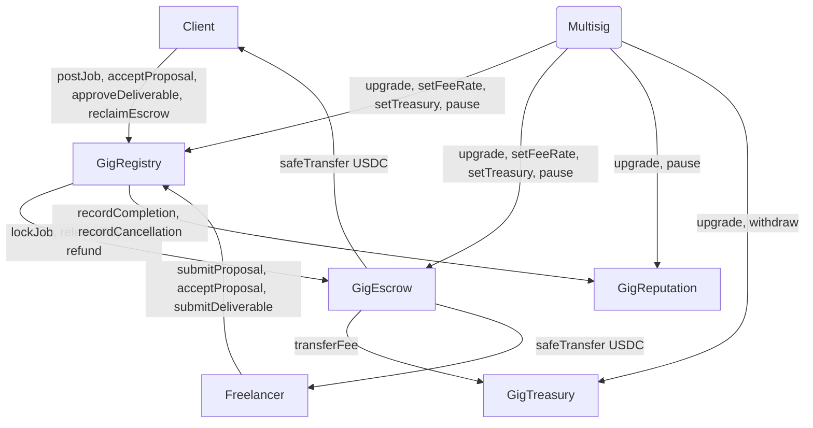
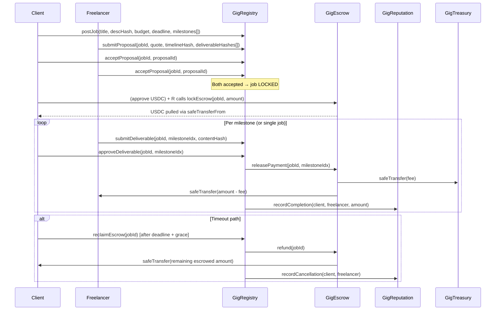

# GigEconomy Smart-Contract Design Doc

**Status:** Draft  
**Authors:** Arc Studio  
**Target Chain:** Arc Testnet (EVM, Paris hardfork)  
**Language / Toolchain:** Solidity 0.8.x, Foundry (forge)  
**Milestone:** v1.0 — Initial deploy  

**Review Tracker:**
- [ ] Design Review
- [ ] Security Review
- [ ] Ops Review
- [ ] Compliance Review

---

## 1. Action Items (living)

_Starts empty. Fill with bullets after each review round as feedback resolves._

---

## 2. Goals / Non-Goals

### Goals
- P2P gig marketplace between freelancers and client companies, settled in USDC onchain
- Full job lifecycle: post → propose → accept (both parties) → work → deliver → release/refund
- Optional milestone support per job (client chooses at creation)
- Timeout-based escrow protection: client reclaims USDC if freelancer misses deadline
- Onchain reputation counters (completed jobs, cancellations, total USDC earned, weighted score)
- Platform fee on every payment release (basis-points, capped at 10%), collected in a treasury contract
- All contracts UUPS-upgradeable, controlled by a multisig

### Non-Goals
- Off-chain arbitration, DAO governance, or token-weighted voting (out of scope v1)
- EIP-712 / off-chain signature-based acceptance (onchain tx only)
- Soulbound NFT badges (out of scope v1)
- Cross-chain bridging or multi-token support (USDC on Arc only)
- Frontend / UI (contract deliverable only)

---

## 3. Requirements

### Functional
- F1: A client can post a job with a title, description hash, budget, deadline, and optional milestone breakdown
- F2: A freelancer can submit a proposal (quote, timeline, deliverable hashes) referencing a job
- F3: Both client and freelancer each send an onchain `acceptProposal()` tx; only when both have accepted is the job locked and escrow funded
- F4: Client deposits USDC into escrow at the moment the job is locked
- F5: Freelancer marks a deliverable (or milestone) as submitted with a content hash
- F6: Client approves the deliverable → USDC (minus fee) released to freelancer; fee sent to treasury
- F7: If the freelancer misses the milestone/job deadline, the client can reclaim the full escrowed amount after a configurable grace period
- F8: Reputation counters are updated atomically on every terminal job state (completed / cancelled)
- F9: Platform admin (multisig) can update fee rate (basis points ≤ 1000) and treasury address
- F10: Platform admin can pause all state-changing operations in emergency

### Security
- S1: No path allows funds to leave escrow to an address that is neither the freelancer nor the treasury
- S2: No path allows double-release or double-refund of the same milestone
- S3: Reentrancy cannot drain escrow (CEI + nonReentrant)
- S4: Fee rate cannot exceed 1000 bps (10%) — enforced in contract, not just off-chain
- S5: Milestone array is capped to prevent gas-limit DOS
- S6: USDC balance delta is asserted on every deposit (fee-on-transfer guard)
- S7: Only the job's assigned freelancer can submit deliverables; only the job's client can approve them

---

## 4. Terminology & Actors

| Term | Definition |
|------|------------|
| Job | A unit of work posted by a client with a budget, deadline, and optional milestones |
| Proposal | A freelancer's bid on a job, including quote, timeline, and deliverable description hashes |
| Escrow | USDC held by GigEscrow on behalf of a locked job until release or refund |
| Milestone | An optional sub-unit of a job with its own USDC amount, deadline, and deliverable hash |
| Deliverable | Content hash (keccak256) representing the submitted work artifact |
| Release | Transfer of escrowed USDC (minus fee) to the freelancer on deliverable approval |
| Refund | Return of escrowed USDC to the client after a timeout or cancellation |
| Fee | Platform's cut (bps of released amount), sent to GigTreasury |
| Reputation Score | Weighted onchain counter per address derived from completed jobs, cancellations, and USDC earned |

### Actors

| Actor | On/Off-chain | Trust Level | Capabilities |
|-------|-------------|-------------|--------------|
| Platform Admin (multisig) | On-chain | Trusted | Upgrade contracts, set fee rate, set treasury address, pause, unpause |
| Client (company) | On-chain | Semi-trusted | Post jobs, fund escrow, accept proposals, approve deliverables, reclaim after timeout |
| Freelancer | On-chain | Semi-trusted | Submit proposals, accept proposals, submit deliverables, receive payment |
| Public | On-chain / Off-chain | Untrusted | Read jobs, proposals, reputation scores |

---

## 5. Language / Runtime

- **Language:** Solidity 0.8.28 (checked arithmetic by default; no unchecked blocks on money paths)
- **EVM target:** Paris hardfork (Arc Testnet constraint; no `PUSH0`, no `mcopy`)
- **Toolchain:** Foundry (forge build, forge test, slither)
- **OpenZeppelin:** 5.1.0 (pinned; 5.2.0+ uses `mcopy` via `Bytes.sol` — incompatible with Paris EVM)
- **Base contracts used:** `UUPSUpgradeable`, `OwnableUpgradeable` (2-step via `Ownable2StepUpgradeable`), `PausableUpgradeable`, `ReentrancyGuardUpgradeable`, `SafeERC20`

---

## 6. Transaction & Execution Model

All state changes are atomic (EVM: all committed or all reverted). The re-entry surface is any function that performs an ERC-20 transfer. CEI (Checks-Effects-Interactions) discipline is applied throughout: state is mutated before any external call. `nonReentrant` guard is additionally applied on every function that calls `safeTransfer` or `safeTransferFrom`.

---

## 7. Chain Standards & Interfaces

- USDC: ERC-20 (6 decimals on Arc). Address read from deployment config — never hardcoded.
- No ERC-721/1155 in v1 (no NFT badges).
- No EIP-712 signatures in v1 (onchain acceptance only).
- `ERC-1271` contract-account support: multisig owner is a contract; `transferOwnership` / `acceptOwnership` works with any address including a Safe.

---

## 8. Architecture Overview

### Component Diagram



### Job Lifecycle Sequence



### Flow of Funds

| Step | Who moves what | Invariant |
|------|---------------|-----------|
| Job locked | Client → GigEscrow (USDC) | `escrow[jobId].balance == sum(milestone amounts)` |
| Deliverable approved | GigEscrow → Freelancer (amount − fee) | `released + refunded + balance == original deposit` |
| Fee transfer | GigEscrow → GigTreasury (fee) | `fee == amount × feeBps / 10000` |
| Timeout refund | GigEscrow → Client (remaining balance) | `balance == 0` after refund |
| Resting state | — | `GigEscrow holds 0 USDC for any fully-resolved job` |

---

## 9. Contract Design

### 9.1 GigRegistry.sol

**Roles:** owner (multisig), anyone (post/propose/accept)

**Storage (EIP-7201 namespace `gigregistry.v1`):**
```
mapping(uint256 => Job) jobs
mapping(uint256 => mapping(uint256 => Proposal)) proposals
mapping(uint256 => uint256) proposalCount
uint256 jobCount
address gigEscrow
address gigReputation
```

**Key structs:**
```solidity
struct Job {
    uint256 id;
    address client;
    bytes32 descHash;
    uint256 totalBudget;
    uint256 deadline;
    JobStatus status;          // Open, Locked, Completed, Cancelled
    uint256 acceptedProposalId;
    bool hasMilestones;
    Milestone[] milestones;
}

struct Milestone {
    uint256 amount;
    uint256 deadline;
    bytes32 deliverableHash;   // set by freelancer on submit
    MilestoneStatus status;    // Pending, Submitted, Approved, Refunded
}

struct Proposal {
    uint256 id;
    address freelancer;
    uint256 quote;
    bytes32 timelineHash;
    bool clientAccepted;
    bool freelancerAccepted;
}
```

**State machine:**
```
Open → (both accepted) → Locked → (all milestones approved) → Completed
Locked → (timeout + grace) → Cancelled
```

**Write functions:**

| Function | Caller | State change | Events | Reverts when |
|----------|--------|-------------|--------|--------------|
| `postJob(descHash, budget, deadline, milestones[])` | Client | Creates Job, increments jobCount | `JobPosted(jobId, client)` | deadline in past, budget 0, milestones > MAX_MILESTONES |
| `submitProposal(jobId, quote, timelineHash, deliverableHashes[])` | Freelancer | Appends Proposal | `ProposalSubmitted(jobId, proposalId, freelancer)` | job not Open, quote 0 |
| `acceptProposal(jobId, proposalId)` | Client or Freelancer | Sets clientAccepted / freelancerAccepted; if both → locks job + calls lockEscrow | `ProposalAccepted(jobId, proposalId, by)`, `JobLocked(jobId)` | wrong caller, already accepted, job not Open |
| `submitDeliverable(jobId, milestoneIdx, contentHash)` | Freelancer | Sets milestone.deliverableHash, status = Submitted | `DeliverableSubmitted(jobId, milestoneIdx, freelancer, contentHash)` | not freelancer, milestone not Pending |
| `approveDeliverable(jobId, milestoneIdx)` | Client | milestone.status = Approved; calls releasePayment | `DeliverableApproved(jobId, milestoneIdx)`, `PaymentReleased(jobId, milestoneIdx, amount)` | not client, milestone not Submitted |
| `reclaimEscrow(jobId)` | Client | job.status = Cancelled; calls refund | `EscrowReclaimed(jobId, client, amount)` | not client, deadline + grace not passed, job not Locked |

**Constants:** `MAX_MILESTONES = 20`, `GRACE_PERIOD = 7 days`

---

### 9.2 GigEscrow.sol

**Roles:** owner (multisig), GigRegistry (caller for lock/release/refund)

**Storage (EIP-7201 namespace `gigescrow.v1`):**
```
mapping(uint256 => EscrowEntry) escrows
address usdc
address gigRegistry
address gigTreasury
uint256 feeBps          // default 250, max 1000
```

**Key struct:**
```solidity
struct EscrowEntry {
    address client;
    address freelancer;
    uint256 totalAmount;
    uint256 releasedAmount;
    uint256 refundedAmount;
}
```

**Write functions:**

| Function | Caller | State change | Events | Reverts when |
|----------|--------|-------------|--------|--------------|
| `lockEscrow(jobId, client, freelancer, amount)` | GigRegistry | Creates EscrowEntry, pulls USDC via safeTransferFrom (delta-asserts received == amount) | `EscrowLocked(jobId, amount)` | not GigRegistry, already locked, amount 0 |
| `releasePayment(jobId, amount, freelancer)` | GigRegistry | Increments releasedAmount, transfers fee to treasury, net to freelancer | `PaymentReleased(jobId, net, fee)` | not GigRegistry, insufficient balance |
| `refund(jobId, client)` | GigRegistry | Increments refundedAmount, transfers remaining balance to client | `EscrowRefunded(jobId, amount)` | not GigRegistry, already refunded |
| `setFeeBps(uint256)` | Owner | Updates feeBps | `FeeBpsUpdated(oldBps, newBps)` | caller not owner, newBps > 1000 |
| `setTreasury(address)` | Owner | Updates gigTreasury | `TreasuryUpdated(addr)` | zero address |

---

### 9.3 GigReputation.sol

**Roles:** owner (multisig), GigRegistry (writer)

**Storage (EIP-7201 namespace `gigreputation.v1`):**
```
mapping(address => ReputationRecord) records
```

**Key struct:**
```solidity
struct ReputationRecord {
    uint256 jobsCompleted;
    uint256 jobsCancelled;
    uint256 totalUsdcEarned;   // freelancer side
    uint256 totalUsdcSpent;    // client side
    uint256 score;             // cached weighted score (see formula)
}
```

**Score formula (stored, recomputed on update):**
```
score = (jobsCompleted × 100)
      − (jobsCancelled × 50)
      + (totalUsdcEarned / 1e6)   // USDC units (6 decimals)
```
Minimum score is 0 (never negative). Formula is versioned via a `scoreVersion` uint8 so upgrades can migrate.

**Write functions:**

| Function | Caller | State change | Events |
|----------|--------|-------------|--------|
| `recordCompletion(client, freelancer, usdcAmount)` | GigRegistry | Increments completed/earned/spent, recomputes score | `ReputationUpdated(addr, score)` × 2 |
| `recordCancellation(client, freelancer)` | GigRegistry | Increments cancelled, recomputes score | `ReputationUpdated(addr, score)` × 2 |

---

### 9.4 GigTreasury.sol

**Roles:** owner (multisig)

**Storage (EIP-7201 namespace `gigtreasury.v1`):**
```
address usdc
```

**Write functions:**

| Function | Caller | State change | Events |
|----------|--------|-------------|--------|
| `withdraw(address to, uint256 amount)` | Owner | Transfers USDC to `to` | `TreasuryWithdrawal(to, amount)` |
| `withdrawAll(address to)` | Owner | Transfers full USDC balance to `to` | `TreasuryWithdrawal(to, amount)` |

Treasury is intentionally simple: it receives fees passively and the multisig withdraws at will.

---

## 10. Deployment & Initialization

All 4 contracts are deployed behind ERC-1967 UUPS proxies.

**Init order:**
1. Deploy GigTreasury implementation + proxy; `initialize(usdc, multisig)`
2. Deploy GigReputation implementation + proxy; `initialize(multisig)`
3. Deploy GigEscrow implementation + proxy; `initialize(usdc, registryPlaceholder, treasury, feeBps, multisig)`
4. Deploy GigRegistry implementation + proxy; `initialize(escrow, reputation, multisig)`
5. Call `GigEscrow.setRegistry(registryAddress)` from multisig to wire the real address

All implementation constructors call `_disableInitializers()` to prevent initialization of the implementation contract itself.

---

## 11. Upgradeability

- **Pattern:** UUPS (ERC-1822). `_authorizeUpgrade` is guarded by `onlyOwner`.
- **Owner:** multisig (Gnosis Safe). 2-step ownership transfer via `Ownable2StepUpgradeable`.
- **Storage compatibility:** EIP-7201 namespaced storage (`keccak256("gigXxx.v1") - 1`) in each contract. New versions append to the namespace struct; no reordering or deletion.
- **No `renounceOwnership`:** `renounceOwnership` is overridden to revert — ownership can never be burned.

---

## 12. Key Management & Signing

| Key | Holder | Powers | Blast radius if compromised |
|-----|--------|--------|----------------------------|
| Multisig (M-of-N Safe) | Platform operator | Upgrade all 4 contracts, set fee rate, set treasury, pause, withdraw treasury | Full platform control; mitigation: M-of-N threshold, rotating signers |
| Client wallet | End-user | Post jobs, fund escrow, approve deliverables, reclaim | Only their own jobs |
| Freelancer wallet | End-user | Submit proposals, submit deliverables, receive USDC | Only their own proposals |

No off-chain signing in v1. Future: EIP-712 for gasless proposals.

---

## 13. Security Considerations

| Vulnerability | Applicable? | Mitigation |
|---------------|-------------|------------|
| Reentrancy | Yes — release and refund transfer USDC | CEI ordering + `nonReentrant` on `releasePayment`, `refund`, `lockEscrow` |
| Access control | Yes — multiple privileged paths | `onlyOwner`, `onlyRegistry` modifiers; explicit caller checks on every write |
| Integer overflow/underflow | Solidity 0.8 checked | No `unchecked` blocks on any money path |
| Unchecked external call / return | Yes — USDC transfers | `SafeERC20.safeTransfer` / `safeTransferFrom` throughout |
| Fee-on-transfer / rebasing tokens | Only USDC accepted | Delta-assert: `balanceAfter − balanceBefore == amount` on every deposit |
| Signature replay | N/A v1 | Onchain accept tx only; no off-chain sigs |
| Front-running / MEV | Low — acceptance is two-step onchain, funds locked only after both accept | No value extraction possible before both parties accept |
| Flash-loan / price manipulation | N/A | No price oracle; USDC amounts fixed at proposal acceptance |
| Oracle manipulation | N/A | No oracle used |
| Denial of service | Yes — milestone loops, unbounded arrays | `MAX_MILESTONES = 20`; pull-over-push payments; no unbounded iteration |
| Delegatecall / proxy safety | Yes — UUPS upgradeable | `_disableInitializers()` in impl constructor; EIP-7201 namespaced storage; `_authorizeUpgrade` onlyOwner |
| Timestamp / block dependence | Yes — deadline and grace period | Deadlines set at creation; tolerance is 7-day grace period (block timestamp manipulation negligible at this scale) |
| Approval persistence | Yes | Clients approve exact escrow amount before lockEscrow; no max-approval anywhere |
| Centralization risk | Yes | Multisig on all privileged roles; upgrade timelock can be layered in v2 |
| Double release / double refund | Yes | `releasedAmount + refundedAmount ≤ totalAmount` enforced; MilestoneStatus state machine prevents double-approval |
| Zero-address treasury / USDC | Yes | Zero-address checks in every setter and initializer |

---

## 14. Trust Model & Threat Analysis

| Actor | Max damage if compromised | Mitigation | Detection |
|-------|--------------------------|------------|-----------|
| Platform multisig | Drain treasury, upgrade to malicious impl, freeze all jobs | M-of-N Safe; add timelock in v2 | Monitor `Upgraded`, `TreasuryWithdrawal` events |
| Client | Grief specific freelancer (post fake job, reclaim after timeout) | Reputation score penalizes cancellations; no loss of other users' funds | `EscrowReclaimed` event with address |
| Freelancer | Ghost on deadline, costing client time (not funds — timeout refund covers) | Reputation score penalizes cancellations | `ReputationUpdated` event |
| Public (unknown caller) | Read-only; no state changes permitted | All write functions have explicit caller guards | — |

---

## 15. Emergency Response & Circuit Breakers

- **Pause:** all 4 contracts inherit `PausableUpgradeable`; `pause()` / `unpause()` callable only by owner (multisig).
- **Paused state blocks:** postJob, submitProposal, acceptProposal, submitDeliverable, approveDeliverable, reclaimEscrow, lockEscrow, releasePayment, refund.
- **Rescue (stuck tokens):** `GigTreasury.withdraw` covers USDC; GigEscrow exposes a `rescueERC20(token, to, amount)` callable by owner for non-USDC tokens accidentally sent to the contract (explicitly rejects the USDC address to prevent misuse).
- **Incident playbook:** (1) multisig calls pause on affected contracts; (2) audit event logs; (3) upgrade to patched implementation or migrate funds via withdraw; (4) unpause.

---

## 16. Failure Scenarios

| Scenario | Outcome |
|----------|---------|
| Client approves deliverable but USDC transfer to freelancer reverts | `releasePayment` reverts entirely (CEI + nonReentrant); state not mutated; client retries |
| Freelancer never submits deliverable | Client calls `reclaimEscrow` after deadline + GRACE_PERIOD; full escrow returned |
| Both parties accept but client never funds escrow (never calls USDC approve) | `lockEscrow` reverts; job stays in Locked state until client provides approval; timeout still ticks |
| Partial milestone approval, then client disappears | Approved milestones already released to freelancer; remaining milestones: freelancer waits or client's timeout protection expires — no mechanism for freelancer to force approval (v1 limitation, future: arbitrator) |
| Upgrade to malicious implementation | Requires M-of-N multisig signers to collude; mitigation: add timelock in v2 |

---

## 17. Priorities & Tradeoffs

| Decision | Tradeoff | Rationale |
|----------|----------|-----------|
| Onchain accept (no EIP-712) | Higher gas per acceptance; simpler security model | Eliminates replay, meta-tx, and signature-phishing attack surfaces in v1 |
| Timeout-only dispute resolution | Freelancer cannot force approval; client can grief by ignoring | Simplest trust-minimized option; arbitrator can be added in v2 as an opt-in role per job |
| Optional milestones (client-chosen) | Complexity in Escrow release logic | Gives clients flexibility; milestone array cap (20) prevents DOS |
| UUPS over transparent proxy | `_authorizeUpgrade` must be in implementation; if logic is broken, no upgrade path | Chosen because it is gas-cheaper for end users; multisig guards upgrade authority |
| Single USDC only | No multi-token flexibility | Arc's native asset is USDC; simplifies accounting and audit surface |
| Score cached on every update | Stale score between updates impossible; slightly higher write gas | Avoids expensive on-the-fly computation in read paths |

---

## 18. Testing Strategy

- **Coverage target:** ≥ 90% branch coverage
- **Unit tests (Foundry):** happy path per function, all revert paths, event emission, fuzz arithmetic (fee calc, score formula, amount boundaries), invariant tests (escrow balance conservation, double-release impossible)
- **Static analysis:** Slither on all 4 contracts
- **Fork/integration tests:** Arc Testnet fork — full job lifecycle end-to-end, timeout path, multi-milestone path
- **Run command:** `forge test --gas-report` + `slither contracts/`
- **Deploy gates:** lint + typecheck clean; all forge tests pass; Slither actionable findings resolved

---

## 19. Third-Party Libraries

| Library | Version | Already a dep? | Why chosen | Security-reviewed? |
|---------|---------|---------------|------------|-------------------|
| @openzeppelin/contracts-upgradeable | 5.1.0 | Yes (pinned) | UUPS, Ownable2Step, Pausable, ReentrancyGuard, SafeERC20 | Yes (OZ audited) |

---

## 20. Monitoring & Alerting

| Event | Threshold | Severity | Playbook |
|-------|-----------|----------|---------|
| `Upgraded(impl)` | Any | Critical | Verify impl address matches known-good deployment |
| `TreasuryWithdrawal(to, amount)` | Any | High | Verify `to` is expected multisig recipient |
| `FeeBpsUpdated` | Any | Medium | Verify new value is expected |
| `Paused` | Any | High | Investigate reason; check for active exploits |
| `EscrowReclaimed` volume spike | > 10/hour | Medium | May indicate platform trust issue |

---

## 21. Common Patterns / Worked Examples

### Example A: Single-escrow job (no milestones)

1. Client calls `GigRegistry.postJob(descHash, 500_000_000 /* 500 USDC */, deadline, [])` → `JobPosted(1, client)`
2. Freelancer calls `GigRegistry.submitProposal(1, 500_000_000, timelineHash, [delivHash])` → `ProposalSubmitted(1, 1, freelancer)`
3. Client calls `GigRegistry.acceptProposal(1, 1)` → `ProposalAccepted(1, 1, client)`
4. Freelancer calls `GigRegistry.acceptProposal(1, 1)` → `ProposalAccepted(1, 1, freelancer)` + `JobLocked(1)`
   - Registry calls `GigEscrow.lockEscrow(1, client, freelancer, 500_000_000)`
   - EscrowEntry created; USDC pulled from client (client must have approved 500 USDC to GigEscrow first)
5. Freelancer calls `GigRegistry.submitDeliverable(1, 0, contentHash)` → `DeliverableSubmitted(1, 0, freelancer, contentHash)`
6. Client calls `GigRegistry.approveDeliverable(1, 0)` → `DeliverableApproved(1, 0)`
   - Registry calls `GigEscrow.releasePayment(1, 500_000_000, freelancer)`
   - Fee = 500_000_000 × 250 / 10000 = 12_500_000 (12.50 USDC) → GigTreasury
   - Net = 487_500_000 (487.50 USDC) → Freelancer
   - `GigReputation.recordCompletion(client, freelancer, 500_000_000)`
   - Both scores updated

### Example B: Timeout refund

1–4: same as above, job locked with 500 USDC in escrow
5. Freelancer ghosts; deadline + 7-day grace passes
6. Client calls `GigRegistry.reclaimEscrow(1)`
   - Registry verifies `block.timestamp > job.deadline + GRACE_PERIOD`
   - Calls `GigEscrow.refund(1, client)` → 500 USDC returned to client
   - `GigReputation.recordCancellation(client, freelancer)` → both cancellation counters incremented
